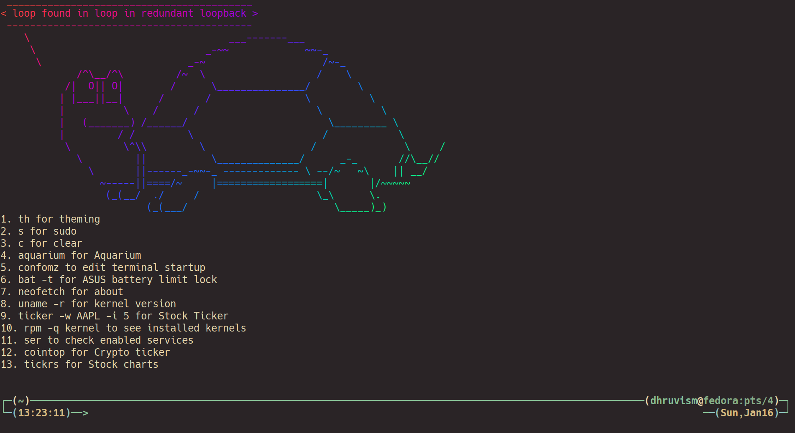

# zsh_config
My customized oh-my-zsh config file with cowsay, tickr, fortune, zsh, theme.sh for changing terminal color scheme.

Required packages
cowsay https://github.com/piuccio/cowsay  ticker https://github.com/achannarasappa/ticker  tickrs https://github.com/tarkah/tickrs  lolcat https://github.com/busyloop/lolcat  fortune https://github.com/shlomif/fortune-mod  zsh https://gist.github.com/derhuerst/12a1558a4b408b3b2b6e  oh-my-zsh https://github.com/ohmyzsh/ohmyzsh  theme.sh https://github.com/lemnos/theme.sh
